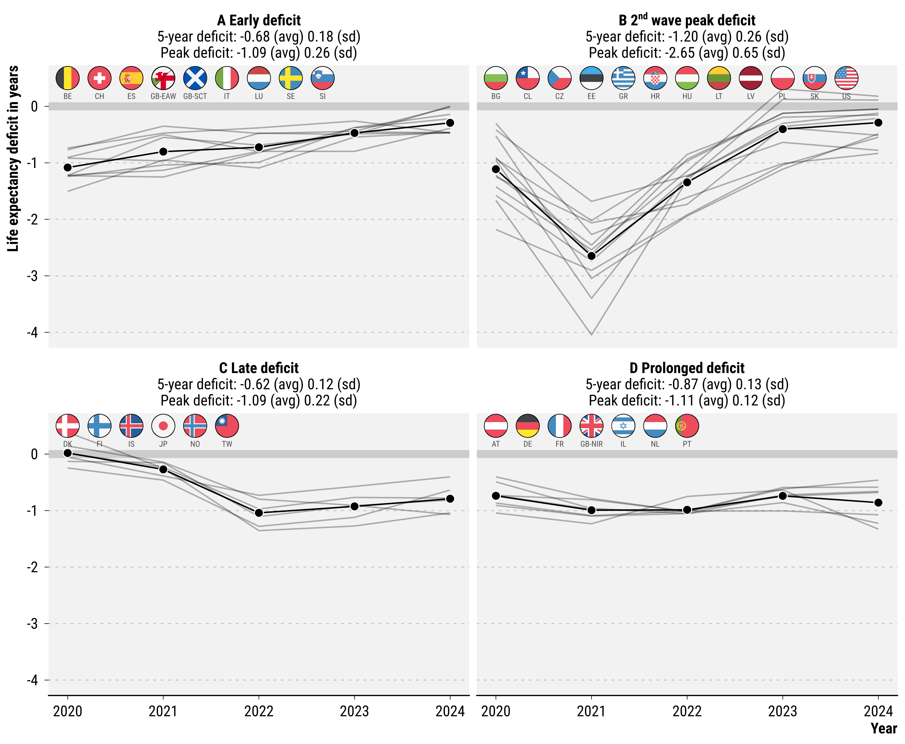

# Temporary Shock or Lasting scar? Life Expectancy Trajectories since 2020

Jonas Schöley  · [jschoeley.com](https://www.jschoeley.com/)

Jennifer B. Dowd 
José Manuel Aburto 
Hannaliis Jaadla 
Antonino Polizzi 
Haohao Lei 
Ridhi Kashyap 

The COVID-19 pandemic led to substantial life expectancy losses globally. Typically, life expectancy returns to previous trajectories after reversals, but whether this is true for the COVID-19 pandemic is not known. We update life expectancy estimates through 2024 for mainly high-income countries with available age-sex disaggregated mortality data from the [STMF](https://www.mortality.org/Data/STMF). We calculate observed life expectancy for individual and combined years 2020-2024 and life expectancy "deficits" compared to pre-pandemic forecasts for each individual year and the overall period. We identify four broad typologies of pandemic mortality experiences across high-income countries, characterized by the timing and magnitude of the mortality shock and their recovery.

# Analysis

The analysis is implemented in R with the exact dependencies being listed in the `renv.lock` file.

## Chapter 1. Download data

We download data required for the analysis. This includes death counts, population numbers, mortality, fertility, and migration rates. The primary sources are STMF, HMD, HFD, WPP, and eurostat.

- `10-make_skeleton.R` Define the "skeleton", the layout, of the data base used for analysis
- `11-download_population_and_rates.R` Download population counts and mortality/fertility rate estimates and projections
- `12-download_death.R` Download data on death counts
- `13-download_netmigration` Download data on net-migration projections used for population projection
- `14-download_lifeexpectancy.R` Download data on published life-expectancy used for validation of our estimates

## Chapter 2. Harmonize data

We transform all data to a common format required for analysis.

- `20-harmonize_population_and_rates.R` Harmonize population data and rates. Project HMD population where missing.
- `21-harmonize_death_with_exposures` Harmonize data on death counts. Ungroup abridged age specific deaths to single ages. Aggregate weekly deaths to annual. Adjust exposures for number of observed weeks in a year.
- `22-harmonize_netmigration.R` Transform netmigration rates to common format.
- `23-harmonize_lifeexpectancy.R` Transform external life expectancy estimates to common format.

## Chapter 3. Merge data

We join the harmonized data to a single input file for analysis.

- `30-join_data` Bring together all data required for analysis in single table. Produces the file `30-analysisinput.rds`.

## Chapter 4. Perform counterfactual population projection

- `40-counterfactual_projection.R` Project population under pandemic and non-pandemic scenarios based on stochastic Lee-Carter extrapolation of pre-pandemic age specific mortality rates.

## Chapter 5. Perform life table estimation and inference

- `50-estimation_and_inference.R` Estimate life tables, e0 deficits, decompositions and associated statistics with PIs. Create aggregates populations like boths sexes combined and 2020-2024 combined. This is where all the estimates are derived statistical inferences made, all implemented in a hughe array. Running this script requires ~70GB of available memory. Produces the central files `50-lifetables.rds` and `50-deficits_and_excesses.rds`.
- `51-assign_clusters` Assign regions to clusters based on their trajectories of life expectancy deficits. Produces file `51-deficit_clusters.csv` as reference table for cluster assignment.

## Chapter 6. Plot results

Results are plotted with pdfs being written to '~/out' with associated `.csv`.

- `60-plot_e0_trends.R`
- `61-plot_e0_deficits.R`
- `62-plot_e0_deficits_age_decomposition.R`

## Chapter 7. Tabulate results

Results are tabulated.

- `71-tabulate_e0_deficits.R`
- `72-tabulate_data_sources.R`

## Chapter 9. Sensitivity analyses

A range of stress tests.

- `90-sensitivity_check_e0_exposures.R`
- `91-benchmark_check_e0.R`
- `92-sensitivity_check_excess_measures.R`
- `94-count_countries_by_type.R`
- `95-sensitivity_check_model_choice.R`
